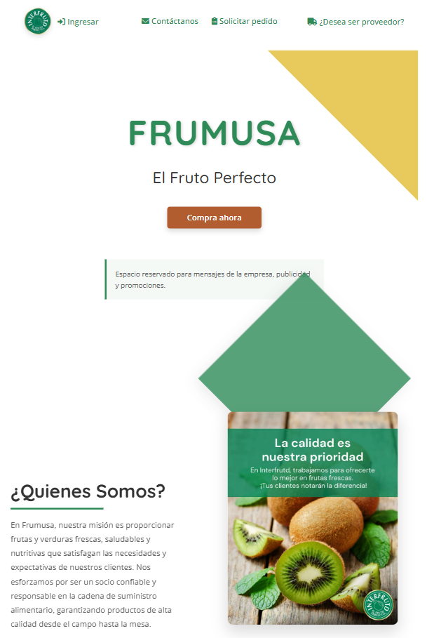
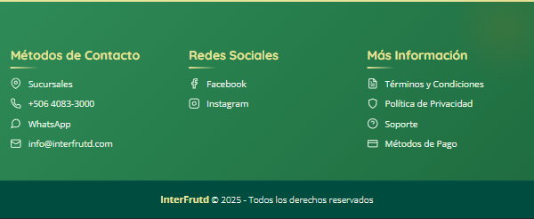

# Vista: Landing Page

# Landing Page (UI Actual)

## Descripción General
La landing page es la página principal de la aplicación Frumusa. Da la bienvenida a los usuarios, presenta la identidad de la empresa y facilita el acceso a los servicios principales, productos y contacto. El diseño es moderno, visualmente atractivo y utiliza los colores corporativos para reforzar la marca.

---

## Imagen
 
 

---

## Componentes Visuales y Funcionales
- **Navbar (barra de navegación superior):**
  - Logo de Frumusa (esquina superior izquierda).
  - Menú de navegación: "Ingresar", "Contáctanos", "Solicitar Pedido".
  - Botón/enlace destacado: "¿Desea ser proveedor?" (esquina superior derecha).
- **Hero Section (sección principal de bienvenida):**
  - Título principal: "FRUMUSA" (con énfasis en el color verde).
  - Subtítulo: "El Fruto Perfecto".
  - Botón de llamada a la acción (CTA): "Compra ahora" (color naranja).
  - Espacio para mensajes promocionales o de la empresa.
  - Elementos visuales: figuras geométricas en colores corporativos.
- **Sección ¿Quiénes Somos?:**
  - Título: "¿Quiénes Somos?".
  - Descripción: Misión y valores de la empresa, enfocada en calidad, frescura y responsabilidad.
  - Imagen: Fotografía de frutas frescas representando los productos.
- **Footer (pie de página):**
  - Información de contacto.
  - Enlaces rápidos.
  - Redes sociales.
  - Newsletter.

---

## Flujo de Usuario
1. El usuario accede a la landing page y visualiza el hero principal con el mensaje de bienvenida y CTA.
2. Puede navegar usando la barra superior para ingresar, contactar o solicitar pedidos.
3. Puede conocer más sobre la empresa en la sección "¿Quiénes Somos?".
4. Puede acceder a información de contacto, enlaces y redes sociales en el footer.

## Accesibilidad y Usabilidad
- Todos los enlaces y botones son accesibles mediante teclado.
- El contraste de colores y el tamaño de fuente aseguran buena legibilidad.
- Las imágenes incluyen texto alternativo descriptivo.
- El diseño es responsivo y se adapta a diferentes dispositivos.
- El CTA es visible y fácil de identificar.

## Mensajes y Estados del Sistema
- **Promocionales:** Espacio para mostrar mensajes o banners promocionales.
- **Errores de navegación:** Mensajes claros si alguna sección no está disponible.
