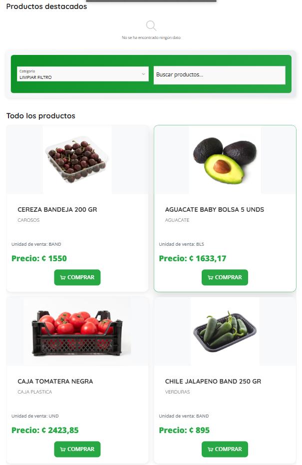

# Vista: Lista de Productos

# Lista de Productos (UI Actual)

## Descripción General
La página de Lista de Productos permite a los usuarios explorar el catálogo completo de productos disponibles en Frumusa. Ofrece herramientas de búsqueda, filtrado y visualización para facilitar la selección de productos, así como acceso rápido a funciones clave como agregar productos al carrito o solicitar pedidos.

## Imagen

## Componentes Utilizados
- Barra de navegación superior (logo, enlaces de navegación, acceso a proveedores)
- Filtros de búsqueda (categoría, barra de búsqueda, botón limpiar filtro)
- Grid de productos destacados
- Grid de todos los productos
- Tarjetas de producto (imagen, nombre, presentación)
- Mensaje de "no se ha encontrado ningún dato" cuando no hay resultados
- Breadcrumbs

## Partes Principales

### 1. Barra de Navegación Superior
- Logo de la empresa
- Enlaces: Ingresar, Contáctanos, Solicitar Pedido
- Opción: ¿Desea ser proveedor?

### 2. Filtros de Búsqueda
- Selector de categoría
- Barra de búsqueda de productos
- Botón para limpiar filtro

### 3. Productos Destacados
- Sección superior para mostrar productos destacados (puede estar vacía si no hay datos)
- Mensaje de "No se ha encontrado ningún dato" cuando la búsqueda o filtro no arroja resultados

### 4. Grid de Todos los Productos
- Tarjetas de producto con:
  - Imagen del producto
  - Nombre y presentación (ejemplo: "CEREZA BANDEJA 200 GR")
- Visualización en formato de cuadrícula

## Funcionalidades Principales
- Búsqueda de productos por nombre o palabra clave
- Filtrado por categoría
- Limpieza rápida de filtros aplicados
- Visualización de productos destacados y de todo el catálogo
- Navegación intuitiva mediante la barra superior
