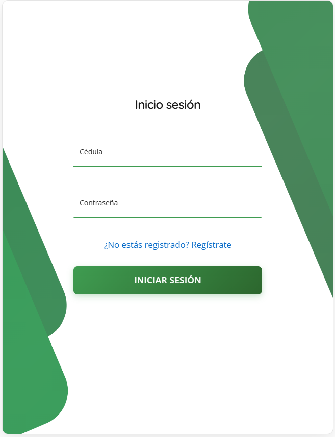

# Vista: Login

# Vista: Inicio de Sesión (UI Actual)

## Descripción General
La vista de inicio de sesión es la puerta de entrada a la plataforma Frumusa. Permite a los usuarios autenticarse de forma segura mediante el ingreso de su cédula y contraseña. El diseño es moderno, minimalista y utiliza elementos visuales verdes que refuerzan la identidad de la marca.

## Imagen

## Componentes Visuales y Funcionales
- **Campo de Cédula:**
  - Entrada de texto para el número de cédula del usuario.
  - Placeholder y etiqueta clara para guiar al usuario.
  - Validación para asegurar que solo se ingresen números válidos.
- **Campo de Contraseña:**
  - Entrada de texto tipo password para ocultar los caracteres.
  - Etiqueta descriptiva.
  - Opción de mostrar/ocultar contraseña (recomendado para futuras versiones).
- **Enlace de Registro:**
  - Texto "¿No estás registrado? Regístrate" en color azul, que redirige a la página de registro de nuevos usuarios.
  - Accesible mediante teclado y con foco visible.
- **Botón de Iniciar Sesión:**
  - Botón principal, color verde, texto blanco y tamaño prominente.
  - Incluye feedback visual al pasar el mouse o al hacer clic.
- **Diseño Visual:**
  - Fondos y formas geométricas verdes en los laterales, aportando dinamismo y coherencia visual.
  - Espaciado generoso y disposición centrada para facilitar la interacción.

## Flujo de Usuario
1. El usuario ingresa su cédula en el primer campo.
2. Ingresa su contraseña en el segundo campo.
3. Si no tiene cuenta, puede hacer clic en el enlace para registrarse.
4. Al hacer clic en "Iniciar Sesión", se validan los datos:
   - Si son correctos, accede a la plataforma.
   - Si hay error, se muestra un mensaje claro y accesible.

## Accesibilidad y Usabilidad
- Todos los campos y botones son accesibles mediante teclado.
- Los campos tienen bordes inferiores resaltados en verde al estar activos, mejorando la visibilidad.
- El enlace de registro es fácilmente identificable y navegable.
- El diseño es responsivo y se adapta a diferentes tamaños de pantalla.
- Se recomienda incluir mensajes de error accesibles (por ejemplo, usando ARIA-live) y validaciones en tiempo real.

## Mensajes y Estados del Sistema
- **Errores de autenticación:** Mensajes claros si la cédula o contraseña son incorrectos.
- **Campos obligatorios:** Indicadores visuales si algún campo está vacío.

## Seguridad
- La contraseña se oculta por defecto al escribirla.

