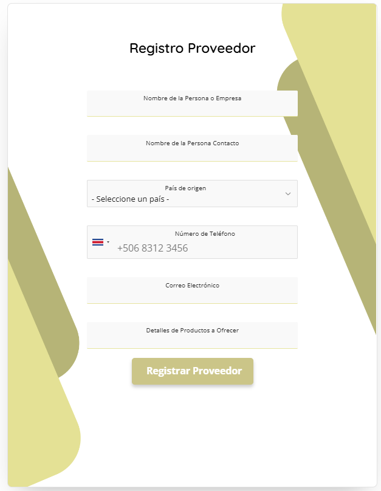

# Vista: Formulario de Proveedores

# Formulario de Registro de Proveedor (UI Actual)

## Descripción General
La vista de registro de proveedor permite a personas o empresas registrarse como proveedores de Frumusa, ingresando información básica de contacto y detalles sobre los productos que pueden ofrecer. El diseño es moderno, minimalista y utiliza tonos amarillos y verdes claros para reforzar la identidad visual.

## Imagen

## Componentes Visuales y Funcionales
- **Campo: Nombre de la Persona o Empresa**
  - Entrada de texto para el nombre completo de la empresa o persona que se registra.
- **Campo: Nombre de la Persona Contacto**
  - Entrada de texto para el nombre de la persona responsable del contacto.
- **Campo: País de origen**
  - Menú desplegable para seleccionar el país de procedencia.
- **Campo: Número de Teléfono**
  - Entrada de texto con prefijo de país seleccionable (por defecto Costa Rica), para ingresar el número de teléfono de contacto.
- **Campo: Correo Electrónico**
  - Entrada de texto para el correo electrónico de contacto.
- **Campo: Detalles de Productos a Ofrecer**
  - Área de texto para describir los productos o servicios que el proveedor puede ofrecer.
- **Botón: Registrar Proveedor**
  - Botón principal, color amarillo, para enviar el formulario y registrar al proveedor.
- **Diseño Visual**
  - Fondos y formas geométricas en tonos amarillos y verdes claros en los laterales, aportando dinamismo y coherencia visual.

## Flujo de Usuario
1. El usuario ingresa el nombre de la persona o empresa.
2. Ingresa el nombre de la persona de contacto.
3. Selecciona el país de origen en el menú desplegable.
4. Ingresa el número de teléfono, seleccionando el prefijo de país si es necesario.
5. Ingresa el correo electrónico de contacto.
6. Describe los productos o servicios que puede ofrecer.
7. Hace clic en "Registrar Proveedor" para enviar la información.

## Accesibilidad y Usabilidad
- Todos los campos y botones son accesibles mediante teclado.
- Los campos tienen bordes inferiores resaltados en amarillo al estar activos, mejorando la visibilidad.
- El botón de registro es grande, visible y con feedback visual al interactuar.
- El diseño es responsivo y centrado en la pantalla.
- Se recomienda mostrar mensajes de error claros y accesibles si algún campo es inválido o está vacío.

## Mensajes y Estados del Sistema
- **Errores de validación:** Mensajes claros si algún campo obligatorio no está completo o el formato es incorrecto.
- **Campos obligatorios:** Indicadores visuales para los campos requeridos.
- **Carga/espera:** Feedback visual (spinner o cambio de estado del botón) mientras se procesa el registro.
- **Confirmación:** Mensaje de éxito al completar el registro correctamente.
