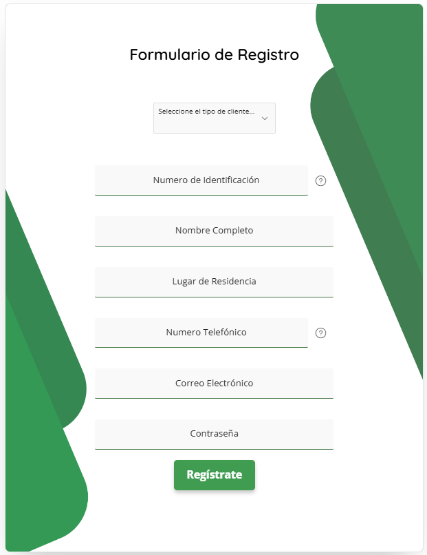

# Vista: Registro

# Formulario de Registro (UI Actual)

## Descripción General
La vista de registro permite a nuevos usuarios crear una cuenta en la plataforma Frumusa, ingresando información personal y de contacto, así como una contraseña segura. El diseño es moderno, minimalista y utiliza elementos visuales verdes para reforzar la identidad de la marca.

## Imagen

## Componentes Visuales y Funcionales
- **Selector de tipo de cliente:**
  - Menú desplegable para seleccionar el tipo de cliente antes de completar el formulario.
- **Campo: Número de Identificación:**
  - Entrada de texto para el número de identificación personal o empresarial.
  - Incluye icono de ayuda para aclarar el tipo de dato requerido.
- **Campo: Nombre Completo:**
  - Entrada de texto para el nombre completo del usuario.
- **Campo: Lugar de Residencia:**
  - Entrada de texto para la dirección o localidad de residencia.
- **Campo: Número Telefónico:**
  - Entrada de texto para el número de teléfono de contacto.
  - Incluye icono de ayuda para formato o ejemplos.
- **Campo: Correo Electrónico:**
  - Entrada de texto para el correo electrónico del usuario.
- **Campo: Contraseña:**
  - Entrada de texto tipo password para la contraseña de acceso.
- **Botón: Regístrate:**
  - Botón principal, color verde, para enviar el formulario y crear la cuenta.
- **Diseño Visual:**
  - Fondos y formas geométricas verdes en los laterales, aportando dinamismo y coherencia visual.

## Flujo de Usuario
1. El usuario selecciona el tipo de cliente en el menú desplegable.
2. Ingresa su número de identificación.
3. Ingresa su nombre completo.
4. Ingresa su lugar de residencia.
5. Ingresa su número telefónico.
6. Ingresa su correo electrónico.
7. Ingresa una contraseña segura.
8. Hace clic en "Regístrate" para enviar la información y crear la cuenta.

## Accesibilidad y Usabilidad
- Todos los campos y botones son accesibles mediante teclado.
- Los campos tienen bordes inferiores resaltados en verde al estar activos, mejorando la visibilidad.
- Los iconos de ayuda proporcionan información adicional sobre los campos.
- El botón de registro es grande, visible y con feedback visual al interactuar.
- El diseño es responsivo y centrado en la pantalla.
- Se recomienda mostrar mensajes de error claros y accesibles si algún campo es inválido o está vacío.

## Mensajes y Estados del Sistema
- **Errores de validación:** Mensajes claros si algún campo obligatorio no está completo o el formato es incorrecto.
- **Campos obligatorios:** Indicadores visuales para los campos requeridos.
- **Carga/espera:** Feedback visual (spinner o cambio de estado del botón) mientras se procesa el registro.
- **Confirmación:** Mensaje de éxito al completar el registro correctamente.
