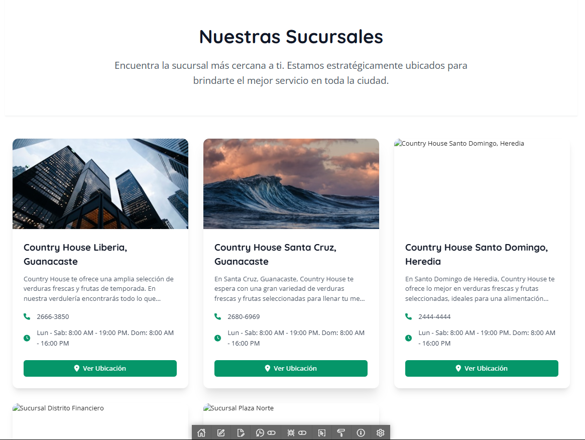

# Vista: Sucursales

# Sucursales (UI Actual)

## Descripción General
La vista de sucursales permite a los usuarios encontrar la sucursal más cercana y conocer detalles relevantes de cada una, como dirección, teléfono, horario y ubicación en el mapa. El diseño es moderno, limpio y utiliza tarjetas informativas para cada sucursal, facilitando la comparación y selección.

## Imagen

## Componentes Visuales y Funcionales
- **Título y Descripción:**
  - Título destacado "Nuestras Sucursales".
  - Descripción breve que invita a encontrar la sucursal más cercana.
- **Tarjetas de Sucursal:**
  - Imagen representativa de la sucursal.
  - Nombre de la sucursal y ubicación (ciudad, provincia).
  - Descripción breve de los servicios o productos destacados.
  - Teléfono de contacto con icono.
  - Horario de atención con icono.
  - Botón "Ver Ubicación" para acceder a la ubicación en el mapa o más detalles.
- **Diseño Visual:**
  - Tarjetas con bordes redondeados y sombra para resaltar cada sucursal.
  - Distribución en filas y columnas para facilitar la visualización en diferentes dispositivos.
  - Uso de iconografía para teléfono y horario.

## Flujo de Usuario
1. El usuario visualiza el listado de sucursales disponibles.
2. Puede leer la información básica de cada sucursal (nombre, descripción, teléfono, horario).
3. Si desea más información o ver la ubicación, hace clic en el botón "Ver Ubicación" de la sucursal deseada.
4. (Opcional) El sistema puede mostrar la ubicación en un mapa o redirigir a una página con más detalles.

## Accesibilidad y Usabilidad
- Las tarjetas y botones son accesibles mediante teclado.
- Los iconos ayudan a identificar rápidamente la información relevante.
- El diseño es responsivo y se adapta a diferentes tamaños de pantalla.
- Se recomienda que las imágenes tengan texto alternativo descriptivo.
- El botón "Ver Ubicación" debe tener un foco visible y ser accesible para lectores de pantalla.

## Mensajes y Estados del Sistema
- **Carga de datos:** Feedback visual si la información de sucursales está cargando.
- **Error de carga:** Mensaje claro si no se pueden mostrar las sucursales.
- **Sin resultados:** Mensaje si no hay sucursales disponibles.
